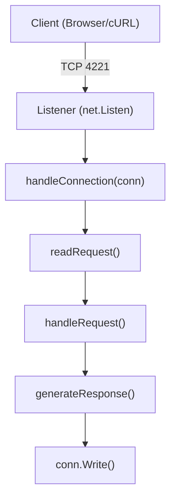
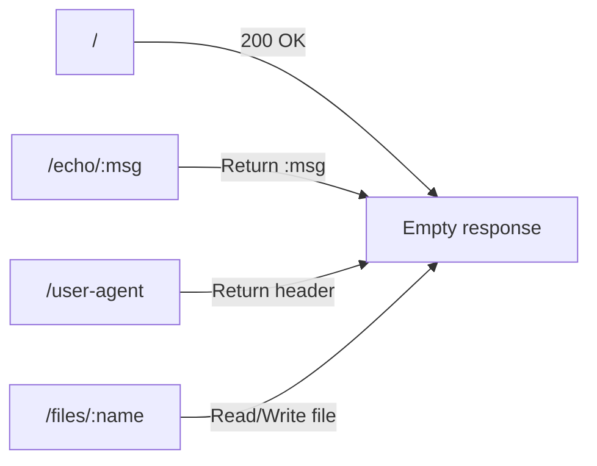
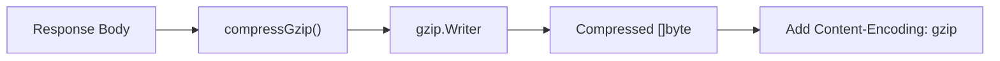

I wanted to really understand how an HTTP server works under the hood — not just call `http.ListenAndServe()`.  
So I decided to **build one from scratch** using nothing but Go’s `net` package.

## 🧠 Why Do This?

When we call `http.ListenAndServe` in Go, a ton of logic happens silently:

- Accepting TCP connections
- Parsing requests (method, path, headers, body)
- Handling concurrency
- Writing structured HTTP responses

I wanted to see _everything_ that happens between the client and the server — byte by byte.

## ⚙️ Architecture Overview

The program opens a raw TCP socket on port **4221**, waits for connections, and spins up a new goroutine for each one.



Every connection is handled independently, so multiple clients can talk to the server at once.

## 📥 Reading the Request

Instead of using Go’s `http.Request`, I manually read from the socket with a buffered reader:

1. **First line:** `GET /echo/hi HTTP/1.1`
2. **Then headers**, until a blank line
3. **Then body**, based on `Content-Length`

That parsing logic alone made me appreciate how much the `net/http` package normally hides.

I store headers in a map so I can check things like `User-Agent`, `Accept-Encoding`, or `Connection`.

## 🧭 Handling Routes

Once I have the method, path, and headers, I handle requests like this:

|Path|Behavior|
|:--|:--|
|`/`|Just a 200 OK|
|`/echo/<msg>`|Returns the message in plain text|
|`/user-agent`|Returns whatever `User-Agent` the client sent|
|`/files/<name>`|GET reads a file, POST writes one|

Here’s how I think of it:



## 📦 Serving and Saving Files

This part was interesting.  
When I start the program, I pass a directory path (like `/tmp/data`) as an argument.  
Then the server joins that path with the file name from the URL.

If I send:

```shell
curl -X POST --data "hello" localhost:4221/files/test.txt
```

It writes `hello` into `/tmp/data/test.txt`.

And later:

```shell
curl localhost:4221/files/test.txt
```

It sends back the file’s content with `Content-Type: application/octet-stream`.

That’s it — I’ve built a basic file server.

## 🌀 Gzip Support

If the request header includes:

```shell
Accept-Encoding: gzip
```

then I compress the response body using Go’s `gzip.Writer`,  
and add `Content-Encoding: gzip` in the headers.



It’s a small feature, but it makes the server feel _real_ — like something browsers can actually talk to.

## 🔁 Persistent Connections

The server keeps a connection open unless the client sends:

```shell
Connection: close
```

That means one TCP connection can handle multiple HTTP requests in sequence — just like HTTP/1.1 pipelining.

## 🧱 Constructing Responses

This part feels almost nostalgic:  
I’m literally writing the response string manually:

```shell
HTTP/1.1 200 OK\r\n
Content-Type: text/plain\r\n
Content-Length: 5\r\n
\r\n
hello
```

No magic. Just text over TCP.  
It made me realize how simple and elegant HTTP really is underneath all the abstractions.

